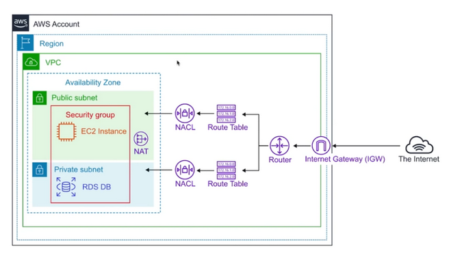

# Security in VPC

VPCs come with defense in depth by design. From the sub-network (NACLs) down to the individual server (security group) and further down to the application itself (secure coding practices), you can set up multiple levels of protection against malicious users and programs.




### VPC
There is one default VPC per region. However, you can have as many custom VPCs as you want and all are private by default.

The default VPC for your AWS environment permits all subnets to have a route out to the internet meaning all subnets in the default VPC are internet accessible. The default setting allows you to immediately deploy instances and each EC2 instance will have both a public and private IP address.

#### CIDR Block
When you create a VPC, you must specify an IPv4 CIDR block for the VPC. The allowed block size is between a /16 netmask (65,536 IP addresses) and /28 netmask (16 IP addresses). 

After you've created your VPC, you further expand your network by adding one to utmost 4 secondary CIDR blocks to your VPC.

The first four IP addresses and the last IP address in each subnet CIDR block are not available for you to use, and cannot be assigned to an instance. For example, in a subnet with CIDR block 10.0.0.0/24, the following five IP addresses are reserved:
```
10.0.0.0: Network address.
10.0.0.1: Reserved by AWS for the VPC router.
10.0.0.2: Reserved by AWS. The IP address of the DNS server is the base of the VPC network range plus two. For VPCs with multiple CIDR blocks, the IP address of the DNS server is located in the primary CIDR. We also reserve the base of each subnet range plus two for all CIDR blocks in the VPC.
10.0.0.3: Reserved by AWS for future use.
10.0.0.255: Network broadcast address. We do not support broadcast in a VPC, therefore we reserve this address.
```

```text
Quick memo:

/32: no IP can change
/24: last IP number can change
/16: last two IP number can change
/8: last three IP number can change
/0: all IPs
```

### Subnet
If a network has a large number of hosts without logically grouped subdivisions, managing the many hosts can be a tedious job. Therefore you use subnets to divide a network so that management becomes easier.

When you create a subnet, be sure to specify which VPC you want to place it in. You can assign both IPv4 and IPv6 ranges to your subnets.

The main benefits of subnets:
* They improve traffic flow, and thus speed & performance of the entire network. An Internet gateway (IGW) receiving a packet and checking which of 5 subnets the packet should be delivered to is much faster than checking 100 instances individually. And if the destination of a packet is within the subnet from where it originates, the traffic stays inside the subnet and doesn't clutter the rest of the VPC.
* Subnets function as logical groups to put your entities inside. It makes it much easier to configure similar resources as a group instead of for every individual instance.

### Security Group
A security group acts as a virtual firewall for your instance to control inbound and outbound traffic. When you launch an instance in a VPC, you can assign up to five security groups to the instance. 

**Security groups act at the instance level, not the subnet level**. Therefore, each instance in a subnet in your VPC can be assigned to a different set of security groups.

The following are the basic characteristics of security groups for your VPC:
* Security Group rules are based on ALLOWs and there is no concept of DENY when in comes to Security Groups. This means you cannot explicitly deny or blacklist specific ports via Security Groups, you can only implicitly deny them by excluding them in your ALLOWs list
* Because of the above detail, everything is blocked by default. You must go in and intentionally allow access for certain ports.
* Security group rules enable you to filter traffic based on protocols and port numbers.
* Security groups are **stateful** — if you send a request from your instance, the response traffic for that request is allowed to flow in regardless of inbound security group rules. Responses to allowed inbound traffic are allowed to flow out, regardless of outbound rules.
* You can specify **separate rules for inbound and outbound traffic.**
* Security groups are specific to a single VPC, so you can't share a Security Group between multiple VPCs. However, you can copy a Security Group to create a new Security Group with the same rules in another VPC for the same AWS Account.
* Security Groups are regional and can span AZs, but can't be cross-regional.
* Outbound rules exist if you need to connect your server to a different service such as an API endpoint or a DB backend. You need to enable the ALLOW rule for the correct port though so that traffic can leave EC2 and enter the other AWS service.

  


### Network Address Translation (NAT)
You can use a network address translation (NAT) instance in a public subnet in your VPC to enable instances in the private subnet to initiate outbound IPv4 traffic to the internet or other AWS services, but prevent the instances from receiving inbound traffic initiated by someone on the internet.

You can also use a NAT gateway, which is a managed NAT service that provides better availability, higher bandwidth, and requires less administrative effort. For common use cases, AWS recommends that you use a NAT gateway rather than a NAT instance.

| Attribute |	NAT gateway |	NAT instance |
|-----------|---------------|----------------|
|Availability |	Highly available. NAT gateways in each Availability Zone are implemented with redundancy. Create a NAT gateway in each Availability Zone to ensure zone-independent architecture.|	Use a script to manage failover between instances.|
|Bandwidth |	Can scale up to 45 Gbps. |	Depends on the bandwidth of the instance type. |
|Maintenance |	Managed by AWS. You do not need to perform any maintenance.	|Managed by you, for example, by installing software updates or operating system patches on the instance. |
|Performance |	Software is optimized for handling NAT traffic. | A generic Amazon Linux AMI that's configured to perform NAT. |
| Cost |	Charged depending on the number of NAT gateways you use, duration of usage, and amount of data that you send through the NAT gateways.	| Charged depending on the number of NAT instances that you use, duration of usage, and instance type and size.|
| Type and size	| Uniform offering; you don’t need to decide on the type or size.| Choose a suitable instance type and size, according to your predicted workload.|
|Public IP addresses| Choose the Elastic IP address to associate with a NAT gateway at creation. |Use an Elastic IP address or a public IP address with a NAT instance. You can change the public IP address at any time by associating a new Elastic IP address with the instance.|
| Security groups|	Cannot be associated with a NAT gateway. You can associate security groups with your resources behind the NAT gateway to control inbound and outbound traffic.|	Associate with your NAT instance and the resources behind your NAT instance to control inbound and outbound traffic.|
| Timeout Handling|When there is a connection timeout, a NAT gateway returns an RST packet to any resources behind the NAT gateway that attempt to continue the connection (it does not send a FIN packet).| When there is a connection timeout, a NAT instance sends a FIN packet to resources behind the NAT instance to close the connection.|

For IPv6 traffic, NAT is not supported, instead we use **Egress-only Internet Gateway**, which is a horizontally scaled, redundant, and highly available VPC component that allows outbound communication over IPv6 from instances in your VPC to the internet, and prevents the internet from initiating an IPv6 connection with your instances.

### NACL

Network Access Control Lists (or NACLs) are like security groups but for subnets rather than instances. The main difference between security groups and NACLs is that security groups are stateless, meaning you can perform both allow and deny rules that may be divergent, depending if traffic is inbound or outbound, for that rule.

Differences between NACLs and Subnets.

| NACL | 	Security Group |
|------|-------------------|
|Operates at the subnet level|Operates at the instance level|
|Supports allow rules and deny rules|Supports allow rules only|
|Is stateless: Return traffic must be explicitly allowed by rules|Is stateful: Return traffic is automatically allowed, regardless of any rules|
|We process **rules in order, starting with the lowest numbered rule**, when deciding whether to allow traffic|We evaluate all rules before deciding whether to allow traffic|
|Automatically applies to all instances in the subnets that it's associated with (therefore, it provides an additional layer of defense if the security group rules are too permissive)|Applies to an instance only if someone specifies the security group when launching the instance, or associates the security group with the instance later on|

* Because NACLs are stateless, you must also ensure that outbound rules exist alongside the inbound rules so that ingress and egress can flow smoothly.
* The default NACL that comes with a new VPC has a default rule to allow all inbounds and outbounds. This means that it exists, but doesn't do anything as all traffic passes through it freely.
* NACLs are evaluated before security groups and **you block malicious IPs with NACLs, not security groups**.
* **Network ACL rules are evaluated by rule number, from lowest to highest, and executed immediately when a matching allow/deny rule is found. Because of this, order matters with your rule numbers**


### Route Table
A route table contains a set of rules, called routes, that are used to determine where network traffic from your subnet or gateway is directed.

Route tables are used to make sure that subnets can communicate with each other and that traffic knows where to go.

When you create a VPC, it automatically has a main route table. The main route table controls the routing for all subnets that are not explicitly associated with any other route table.


##### Route priority
We use the most specific route in your route table that matches the traffic to determine how to route the traffic (longest prefix match).


### Internet Gateway (IGW)

An internet gateway is a horizontally scaled, redundant, and highly available VPC component that allows communication between your VPC and the internet.

An internet gateway serves two purposes: to provide a target in your VPC route tables for internet-routable traffic, and to perform network address translation (NAT) for instances that have been assigned public IPv4 addresses.

An internet gateway supports IPv4 and IPv6 traffic. It does not cause availability risks or bandwidth constraints on your network traffic. There's no additional charge for having an internet gateway in your account.
